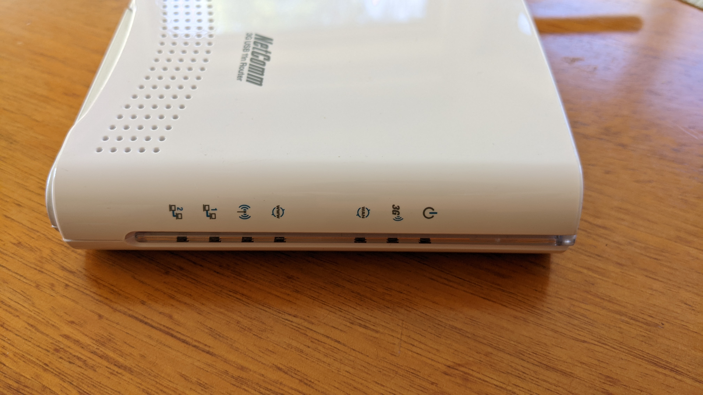

# NetComm 3G USB 11n Router (3G17Wn)

## Images

## Hardware notes
- DC jack is 12V - from bottom of device and in user manual
- There are pins for a serial port on the PCB with a header already soldered on.

## Links
- Product page: https://support.netcommwireless.com/legacy-products/3G17WN

## Disassembly
1. Unscrew and take off the Wi-Fi antenna to get it out of the way.
1. Rotate the stand on the bottom out and undo the two screws underneath.
1. Pry the plastic shell apart by the seams on the back where the ports are, on each side of the port bank - there are clips there.
