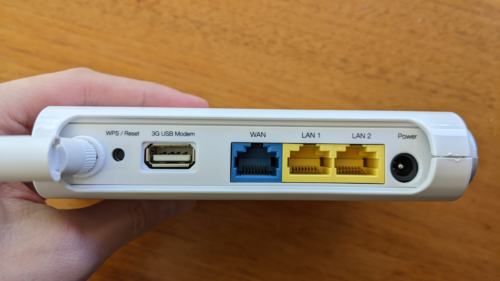

# NetComm 3G USB 11n Router (3G17Wn)

## Images

## Hardware notes
- DC jack is 12V - from bottom of device and in user manual

## Links
- Product page: https://support.netcommwireless.com/legacy-products/3G17WN

