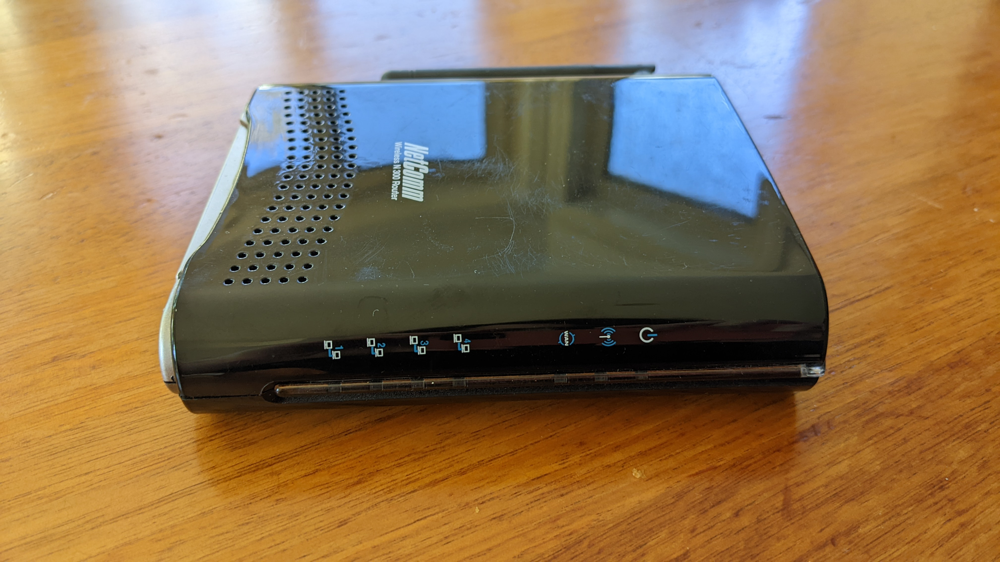
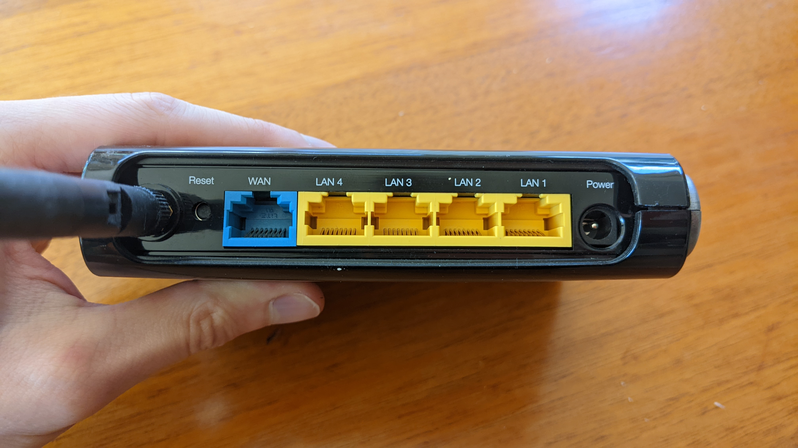
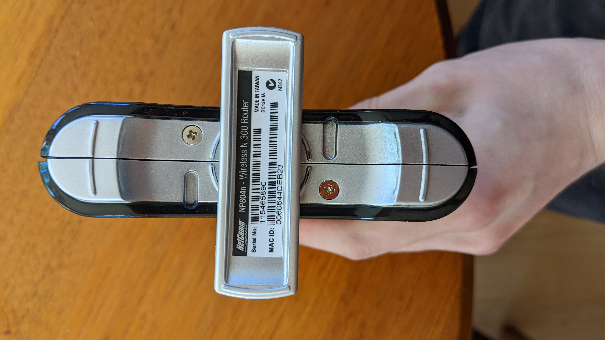

# NetComm Wireless N300 router (NP804n)

## Images

## Hardware notes
- DC jack is 12V - from bottom of device and in user manual

## Links
- Product page: https://support.netcommwireless.com/legacy-products/NP804N
- It's supported by DD-WRT as Seneo ESR9752: https://forum.dd-wrt.com/phpBB2/viewtopic.php?p=969214
    - https://wiki.dd-wrt.com/wiki/index.php/Supported_Devices#NetComm
